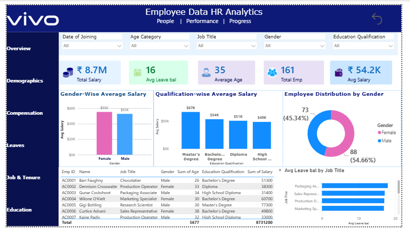

# Vivo-Inspired HR Analytics Dashboard

## 📊 Project Overview

This is a self-initiated HR Analytics project developed using Microsoft Power BI and a sample employee dataset.

The dashboard was designed around a hypothetical Vivo HR use case to demonstrate how HR teams can use data visualization and analytics to understand workforce demographics, compensation, employee distribution, and leave balances.

> **Disclaimer:** This project does not use confidential or proprietary Vivo employee data. The dataset is a sample/public dataset and the Vivo theme is used only to demonstrate a company-relevant HR analytics use case.

## 🎯 Project Objective

The objective of this project is to transform employee-level data into an interactive HR dashboard that can help HR professionals analyze:

- Workforce size
- Salary expenditure
- Average employee salary
- Employee demographics
- Gender-wise salary differences
- Qualification-wise salary differences
- Employee age distribution
- Leave balances
- Job-title level workforce metrics

## 🛠️ Tools & Technologies

- Microsoft Power BI
- DAX
- Microsoft Excel
- Data Visualization
- HR Analytics
- Data Modeling

## 📌 Dashboard KPIs

- Total Employees
- Total Salary
- Average Salary
- Average Age
- Average Leave Balance

## 📈 Key Analysis

- Gender-wise average salary
- Qualification-wise average salary
- Employee distribution by gender
- Employee distribution by age category
- Employee distribution by education qualification
- Leave balance by job title

## 🎛️ Interactive Filters

The dashboard includes slicers for:

- Date of Joining
- Age Category
- Gender
- Job Title
- Education Qualification

## 🖼️ Dashboard Preview

## 💡 Business Value

This dashboard demonstrates how HR teams can use employee data to identify patterns in workforce composition, compensation, demographics, qualifications, and leave balances.

## 👤 Project Type

**Self-Initiated HR Analytics Project**

**Designed for:** Hypothetical Vivo HR Use Case

**Tool:** Microsoft Power BI
